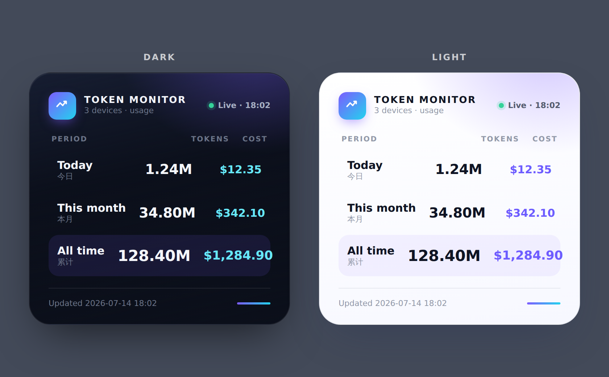

# Token Monitor — Widgy widget

A polished iOS/macOS home-screen widget for [Widgy](https://apps.apple.com/app/widgy-widgets/id1524540481)
that shows **today / this month / all-time tokens and USD cost**, pulled live from a
Token Monitor hub (the Cloudflare Worker or the self-hosted Node hub — both speak the
same `GET /api/stats`).



> `preview.png` is a rendered mock-up of the target design; `preview.html` is the
> source you can open in a browser to inspect colors and spacing. Widgy itself is
> assembled from native layers (see [Build it in Widgy](#build-it-in-widgy)) — the
> HTML is a reference, not something you import.

## Prerequisites

1. A running Token Monitor hub with at least one device reporting into it.
   - Cloudflare Worker: follow [`../README.md`](../README.md).
   - Self-hosted Node hub: `npm run hub` from the repo root.
2. The hub's `TOKEN_MONITOR_SECRET`.

The widget reads the aggregated snapshot at `GET /api/stats`, whose shape is
documented in [`../README.md` → *Stats response shape*](../README.md#stats-response-shape).
Only two fields per period are needed:

```jsonc
{ "periods": {
    "today":   { "totalTokens": 1240000, "costUsd": 12.35 },
    "month":   { "totalTokens": 34800000, "costUsd": 342.10 },
    "allTime": { "totalTokens": 128400000, "costUsd": 1284.90 }
} }
```

### Authentication

Widgy runs each script in a hidden `WKWebView`, which chokes on the CORS preflight
that an `Authorization: Bearer` header triggers. Use the **`?secret=` query string**
instead — it stays inside the device-local Widgy config and never reaches an external
log. If you'd rather keep the secret out of the widget entirely, enable
`PUBLIC_STATS_ENABLED=1` on the Worker and point the scripts at `/api/public/stats`
(no secret, same `periods` shape — it just drops the per-device list and account ids).

## Data-source scripts

Both scripts below use Widgy's **async / no `main()`** Web View template: paste the
code, and the final `sendToWidgy(...)` sets that layer's text. Set `HUB` and `SECRET`
at the top of each.

### A. Designed layout — one number per layer

This drives the multi-row card in the preview. Add one Web View per visible number,
paste this script into each, and change only `FIELD`:

```js
// Token Monitor — Widgy data source (async / no main())
const HUB    = 'https://token-monitor-hub.<your-subdomain>.workers.dev';
const SECRET = '<your TOKEN_MONITOR_SECRET>';
const FIELD  = 'today.tokens';   // <period>.<metric> — see the table below

function fmtTokens(n) {
  n = Number(n) || 0;
  if (n >= 1e9) return (n / 1e9).toFixed(2) + 'B';
  if (n >= 1e6) return (n / 1e6).toFixed(2) + 'M';
  if (n >= 1e3) return (n / 1e3).toFixed(1) + 'K';
  return String(Math.round(n));
}
function fmtCost(n) {
  return '$' + (Number(n) || 0).toLocaleString('en-US', {
    minimumFractionDigits: 2, maximumFractionDigits: 2,
  });
}

fetch(HUB + '/api/stats?secret=' + encodeURIComponent(SECRET))
  .then(r => r.json())
  .then(stats => {
    if (FIELD === 'updated') {
      const d = new Date(stats.updatedAt);
      return sendToWidgy(isNaN(d) ? '—' : d.toLocaleTimeString([], { hour: '2-digit', minute: '2-digit' }));
    }
    const [period, metric] = FIELD.split('.');
    const p = (stats.periods && stats.periods[period]) || {};
    sendToWidgy(metric === 'cost' ? fmtCost(p.costUsd) : fmtTokens(p.totalTokens));
  })
  .catch(() => sendToWidgy('—'));   // Widgy keeps the last good value on a blank/throw
```

| Layer              | `FIELD`          |
|--------------------|------------------|
| Today · tokens     | `today.tokens`   |
| Today · cost       | `today.cost`     |
| This month · tokens| `month.tokens`   |
| This month · cost  | `month.cost`     |
| All-time · tokens  | `allTime.tokens` |
| All-time · cost    | `allTime.cost`   |
| Updated time       | `updated`        |

### B. Minimal — one script, one layer

Prefer a single text layer? This returns all three periods as one aligned block; set
the text layer to a **monospaced** font so the columns line up.

```js
const HUB    = 'https://token-monitor-hub.<your-subdomain>.workers.dev';
const SECRET = '<your TOKEN_MONITOR_SECRET>';

function fmtTokens(n) {
  n = Number(n) || 0;
  if (n >= 1e9) return (n / 1e9).toFixed(2) + 'B';
  if (n >= 1e6) return (n / 1e6).toFixed(2) + 'M';
  if (n >= 1e3) return (n / 1e3).toFixed(1) + 'K';
  return String(Math.round(n));
}
function fmtCost(n) {
  return '$' + (Number(n) || 0).toLocaleString('en-US', {
    minimumFractionDigits: 2, maximumFractionDigits: 2,
  });
}
const pad = (s, n) => String(s).padEnd(n);

fetch(HUB + '/api/stats?secret=' + encodeURIComponent(SECRET))
  .then(r => r.json())
  .then(s => {
    const p = s.periods || {};
    const row = (label, key) => {
      const d = p[key] || {};
      return pad(label, 7) + pad(fmtTokens(d.totalTokens), 8) + fmtCost(d.costUsd);
    };
    sendToWidgy([row('Today', 'today'), row('Month', 'month'), row('Total', 'allTime')].join('\n'));
  })
  .catch(() => sendToWidgy('Token Monitor\nunavailable'));
```

## Build it in Widgy

1. **New widget** → pick a size (the preview is tuned for **Medium/Large**).
2. **Background**: add a *Rectangle* layer, corner radius ~30, and fill it with the
   surface color/gradient from the spec below.
3. **Numbers**: for layout **A**, add a *Web View* data source per number
   (Add → Data Source → Web View → *async / no main()* template), paste script **A**,
   set its `FIELD`; then add a *Text* layer bound to that Web View. Duplicate for each
   row. For layout **B**, one Web View + one Text layer is enough.
4. **Labels** (`PERIOD / TOKENS / COST`, `Today / 今日`, …) are plain static *Text*
   layers — no data source needed.
5. **Style** each layer per the spec, then save and add the widget to your Home Screen.

### Design spec

Colors and type used in the preview — swap freely, but these are validated for
contrast in both themes. Numbers use the system font with **tabular figures** so
values stay vertically aligned.

| Token            | Dark                     | Light                    |
|------------------|--------------------------|--------------------------|
| Surface          | `#161d31` → `#0b0f1a`     | `#ffffff` → `#f7f8ff`     |
| Primary ink      | `#f4f6fb`                | `#0f1424`                |
| Secondary ink    | `#a8b0c4`                | `#545b6e`                |
| Muted (captions) | `#6b7488`                | `#9198a8`                |
| Cost accent      | `#67e8f9`                | `#6d5cff`                |
| Brand accent     | `#7c5cff` → `#22d3ee` (gradient: logo, total-row tint, footer bar) |
| Total-row tint   | `rgba(124,92,255,.12)`   | `rgba(124,92,255,.07)`   |

| Element            | Size / weight        | Color         |
|--------------------|----------------------|---------------|
| Wordmark           | 13, bold, +tracking  | primary ink   |
| Column header      | 10, semibold, UPPER  | muted         |
| Period label       | 15, semibold         | primary ink   |
| Period caption     | 11                   | muted         |
| Token value        | 19, semibold         | primary ink   |
| Cost value         | 15, bold             | cost accent   |
| All-time row       | +2px on the values, over the total-row tint |

## Notes

- **Refresh cadence.** iOS has no cheap push channel for widgets, so Widgy re-runs the
  scripts on its own timer (a few minutes). This matches the hub — set a shorter Widgy
  refresh if you want it snappier, at the cost of battery.
- **Requests.** Layout A fetches once per visible number on each refresh. Even 7 layers
  at a 2-minute cadence stays far inside the Worker free tier; layout B is a single
  fetch if you want to minimize calls.
- **Offline / errors.** On a failed fetch the scripts send `—` (or the last block), and
  Widgy keeps showing the previous good value.
